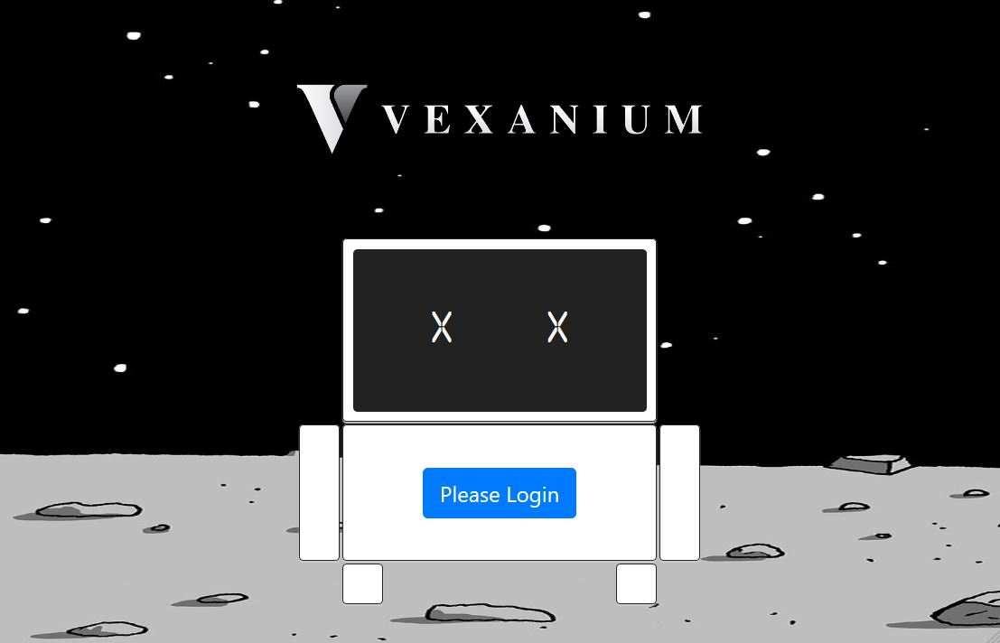
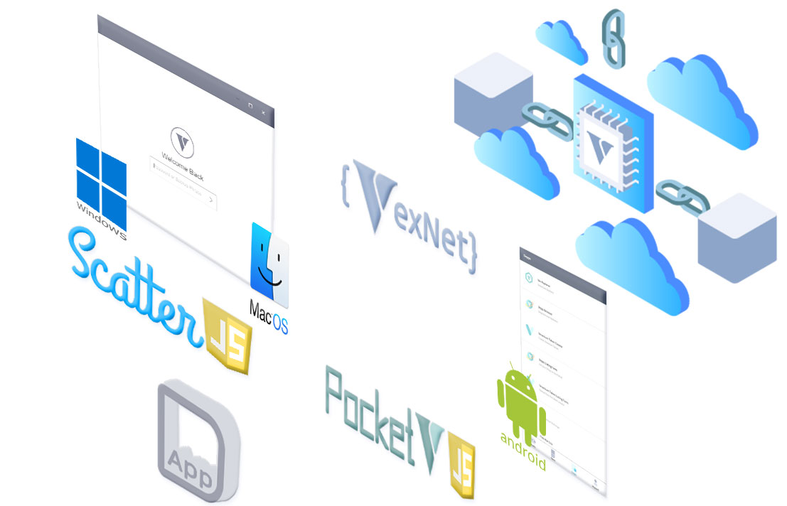

# DApps
Vexanium Decentralized Apps (DApps) Core, Basic, and Samples



## Introduction
Here you'll be guided on creating your own Vexanium DApps in a simple and quick fashioned way.  
You just need to know the basic of html, css, and js. Yup, the very basic of them.  
You don't even have to give a shit about any autistic js out there.  
No npm, no yarn, no need to compile lot of modules nor libraries online.  
You can develop the app offline. 
You basically don't need to buy/rent/setup a server, it can be run locally.  
Even though you decided to run a server, you can place as many dapps as you want
as it is lightweight and easy to configure.

Hold up the excitement, let's take a look on how it works:

Basically your **DApp** needs to connect to our **VexWallet**.  
Use **ScatterJS** to connect to **Windows/MacOS Wallet**,  
and **PocketVexJS** to **Android Wallet** via **dapp browser** in it.  
Then make use of **VexNet** method to do any transactions to **Vexanium Blockchain Network**.  
That's all, that's the main concept.

## Core JS
Essential Javascripts needed for creating DApps  
Only these 3 Javascripts needed:  
1. vex.min.js
2. scatterjs-core.min.js
3. scatterjs-plugin-vexjs.min.js
> Get them from [core](core) folder in this repo or
download the compressed [release](https://github.com/vexanium/DApps/releases) file  
Then just include them on your main .html file inside ```<head>``` tag
```html
<html>
<head>
	...
	<script src="js/vex.min.js" type="text/javascript"></script>
	<script src="js/scatterjs-core.min.js" type="text/javascript"></script>
	<script src="js/scatterjs-plugin-vexjs.min.js" type="text/javascript"></script>
</head>
<body>
	...
</body>
</html>
```
As explained before, it's different with Android, you need to browse your app in **dapp browser**
and require **PocketVexJS** to connect to the wallet. So if you want your app to be compatible with
**VexWalletAndroid** as well, add this javascript: ```pocket.vex.min.js```

Let's follow the lessons below step by step for better understanding

## Lessons
Go to each lesson folder, and try it out    
1. [Basic DApp (Simple)](basic-simple)  
   Pure Javascript (No VexWalletAndroid compability yet)  
2. [Basic DApp (Stylish)](basic-stylish)  
   CSS3, Bootstrap, JQuery (No VexWalletAndroid compability yet)   
3. [DApp Browser Integrated](dbrowser-int)  
   Integrate to dapp browser for VexWalletAndroid compability
   
## Coda
We'll wait for your Creativity. Submit your DApps at VexWallet Android.  
